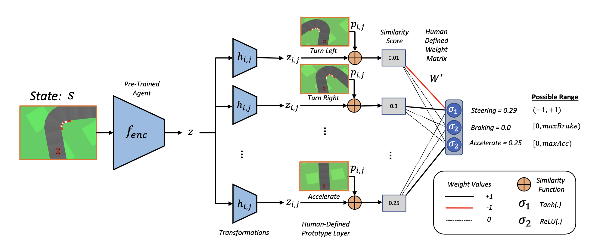

# Prototype Wrapper Network




This is the repository for the paper *"Towards Interpretable Deep Reinforcement Learning with Human-Friendly Prototypes"*[^1].

The paper was published as a spotlight at ICLR 2023, Rwanda, see paper [here](https://openreview.net/forum?id=hWwY_Jq0xsN)

The paper proposes a "wrapper" component which can be added to any pre-trained agent to make it interpretable-by-design. Specifically, the original agent $f_{enc}$ is used as an encoder, which produces an output $z$. This representation is then transformed by going through multiple different MLP networks $h_{i,j}$ which then assess its similarity to pre-defined human-interpretable prototypes $p_{i,j}$ for common concepts used in the domain. For example, in the figure above, common concepts used in driving are "right turn", "left turn", "accelterate", and "brake". So, we defined these a-priori alongside the output weight matrix $W'$, which together form an interpretable design for the agent.

In the above figure for example, the agent sees its current state $S$ as being most similar to the prototypes for "turning left" and and "accelerating", so the similarity function outputs a high value for these, which then produces the final output action.

This repo uses a lot of the code from Jain (2022)[^2], from which we use the pre-trained agent available there.

--------------

To reproduce these results for the Car Racing Domain Simply copy the whole repo and run these commands in the terminal whilst in the directory:

```
python3 -m venv pwnet
source pwnet/bin/activate
pip3 install --upgrade pip
pip install toml
pip install numpy
pip3 install torch torchvision torchaudio
pip install gym'[box2d]'
pip install tqdm
pip install gym==0.24.0
pip install gym-notices==0.0.7
pip install scikit-learn
```

Then run

```
Python collect_data.py
```

When you have the collected data you can now train the various wrappers. Simply run...

```
Python run_kmeans.py
Python run_pwnet*.py
Python run_pwnet.py
```

And the terminal will print off the results, reproducing the results for Car Racing from the paper.

------------------------

## To-do List
1. Add other domains from paper.
2. ... 

For any questions or just to have a conversation about research in general, please email ekenny@mit.edu.


[^1]: Kenny, E.M., Tucker, M. and Shah, J., Towards Interpretable Deep Reinforcement Learning with Human-Friendly Prototypes. In *The Eleventh International Conference on Learning Representations.* Kigali, Rwanda, 2023.

[^2]: Jinay Jain. Jinayjain/deep-racing: Self-driving racecar using reinforcement learning (proxi- mal policy optimization) in pytorch, 2022. URL https://github.com/JinayJain/ deep-racing.

